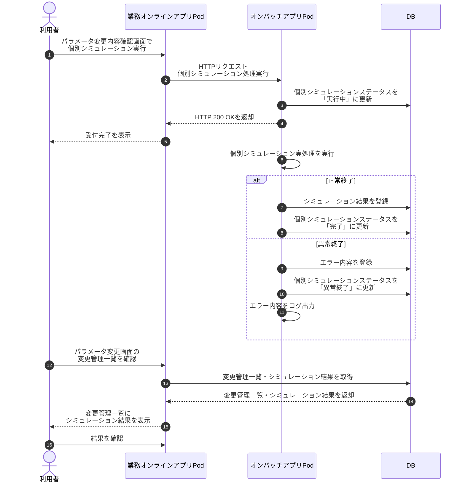
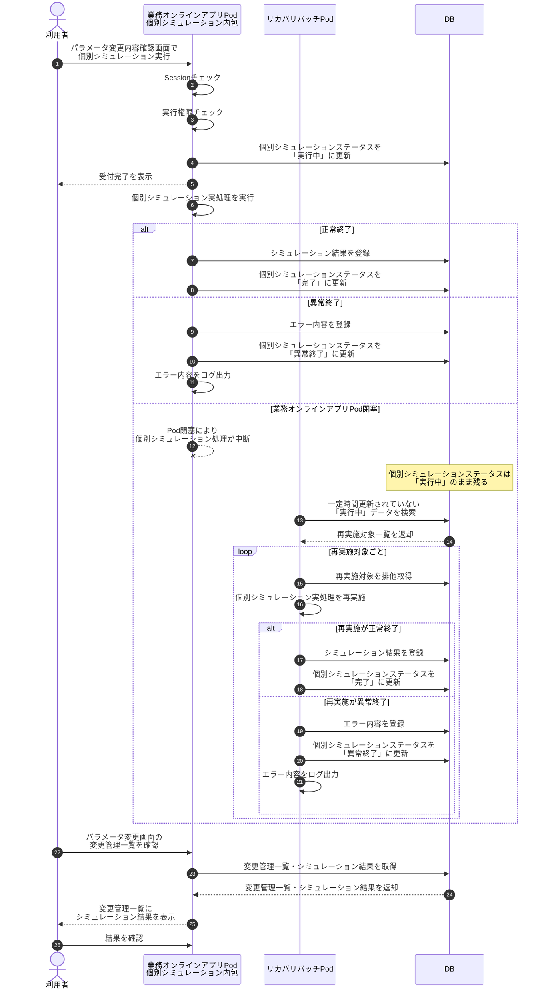

# 個別シミュレーション処理方式 比較提案資料

## 1. 目的

業務オンラインアプリPodから実行される「個別シミュレーション処理」について、以下2案を比較し、採用方針を整理する。

本資料では、以下の理由により **「業務オンラインアプリPod内包 + リカバリバッチ方式」** の採用を推奨する。

- 業務オンラインアプリの既存Sessionチェックで認証・認可を確認できる
- オンバッチアプリPodへのHTTP連携が不要
- Pod間通信に伴う基盤Tへのhosts対応・名前解決調整が不要
- 既存の画面操作・権限管理と整合しやすい
- Pod閉塞時はリカバリバッチにより「実行中」の個別シミュレーションを再実施できる

---

## 2. 比較対象

| 案 | 方式 | 概要 |
|---|---|---|
| 案1 | オンバッチアプリPod切り離し方式 | 業務オンラインアプリPodからHTTPでオンバッチアプリPodを呼び出し、オンバッチ側で個別シミュレーションを実行する |
| 案2 | 業務オンラインアプリPod内包 + リカバリバッチ方式 | 業務オンラインアプリPod内で個別シミュレーションを実行し、Pod閉塞時はリカバリバッチが「実行中」の処理を再実施する |

---

## 3. 案1：オンバッチアプリPod切り離し方式

### 3.1 概要

業務オンラインアプリPodは、利用者からの実行要求を受け付けた後、HTTPでオンバッチアプリPodの個別シミュレーション処理を呼び出す。

オンバッチアプリPodは、個別シミュレーションステータスを「実行中」に更新し、業務オンラインアプリPodへHTTP 200を返却する。

その後、オンバッチアプリPod内で個別シミュレーションの実処理を継続する。

### 3.2 処理シーケンス



---

## 4. 案2：業務オンラインアプリPod内包 + リカバリバッチ方式

### 4.1 概要

業務オンラインアプリPod内に個別シミュレーション処理を内包する。

利用者からの実行要求を受けた業務オンラインアプリPodが、既存のSessionチェックにより利用者の認証・認可を確認する。

認証・認可確認後、個別シミュレーションステータスを「実行中」に更新し、利用者には受付完了を返却する。

その後、業務オンラインアプリPod内で個別シミュレーション実処理を実行する。

業務オンラインアプリPodが閉塞した場合、個別シミュレーションステータスが「実行中」のまま残る。

リカバリバッチが定期的に「実行中」の個別シミュレーションを検出し、再実施する。

### 4.2 推奨方式の処理シーケンス



---

## 5. 総合比較

| 比較観点 | 案1：オンバッチアプリPod切り離し方式 | 案2：業務オンラインアプリPod内包 + リカバリバッチ方式 |
|---|---|---|
| 認証・認可 | サービス間認証やトークン設計が必要 | 既存Sessionチェックを利用可能 |
| 基盤T対応 | Pod間通信に伴うhosts対応・名前解決調整が必要になる可能性あり | hosts対応・名前解決調整が不要 |
| 構成単純性 | オンバッチアプリPodが必要 | 既存業務オンラインアプリPodで対応可能 |
| Pod間HTTP通信 | 必要 | 不要 |
| 初期実装コスト | Pod分離・通信設計が必要 | 既存アプリ内で対応しやすい |
| 画面連携 | HTTP経由で連携 | 同一アプリ内で画面・Session・権限と連携しやすい |
| 責務分離 | オンライン処理とシミュレーション処理を分離できる | 同一Pod内に処理が存在する |
| オンライン性能影響 | シミュレーション負荷をオンラインPodから分離できる | 負荷対策が必要 |
| 障害時リカバリ | 別途リカバリ設計が必要 | リカバリバッチで再実施可能 |
| 二重実行リスク | 実行管理テーブルで制御可能 | 実行管理テーブルで制御可能 |
| 監視対象 | 業務オンラインアプリPod + オンバッチアプリPod | 業務オンラインアプリPod + リカバリバッチPod |
| 採用しやすさ | 追加構成・追加調整が必要 | 今回の前提では採用しやすい |

---

## 6. 採用方針

本件では、以下の方式を推奨する。

```text
業務オンラインアプリPod内包 + リカバリバッチ方式
```

### 6.1 推奨理由

本件では、個別シミュレーション処理の実行起点が業務オンラインアプリの画面操作であり、利用者の認証・権限確認も業務オンラインアプリ側で完結できる。

そのため、オンバッチアプリPodへ切り離すよりも、業務オンラインアプリPod内に処理を内包する方が、認証・認可、画面連携、基盤対応の観点で合理的である。

特に、オンバッチアプリPodへ切り離した場合に必要となる以下の対応を回避できる。

- 基盤Tへのhosts対応
- Pod間HTTP通信設計
- サービス間認証設計
- 通信タイムアウト・リトライ設計
- オンバッチアプリPodの追加監視
- 呼び出し元と呼び出し先の責務分断による調査複雑化

一方で、業務オンラインアプリPod内包方式では、Pod閉塞時に実行中処理が中断されるリスクがある。

このリスクについては、DBに保持する個別シミュレーションステータスを利用し、リカバリバッチが「実行中」のまま残った処理を再実施することで対応する。

---

## 7. 推奨構成

```text
業務オンラインアプリPod
  - 利用者操作の受付
  - Sessionチェック
  - 実行権限チェック
  - 個別シミュレーションステータス更新
  - 個別シミュレーション実処理
  - シミュレーション結果登録
  - 変更管理一覧の表示
  - シミュレーション結果の参照

リカバリバッチPod
  - ステータスが「実行中」の個別シミュレーションを検出
  - 一定時間以上更新されていない処理を再実施対象とする
  - 対象を排他取得
  - 個別シミュレーションを再実施
  - 完了または異常終了へステータス更新

DB
  - 実行管理
  - ステータス管理
  - シミュレーション結果管理
  - エラー内容管理
```

---

## 8. リカバリバッチ設計のポイント

### 8.1 再実施対象の判定条件

単純にステータスが「実行中」のものをすべて再実施すると、正常に実行中の処理まで再実施してしまう可能性がある。

そのため、以下の条件を組み合わせて再実施対象を判定する。

```text
ステータス = '実行中'
かつ
最終更新日時 < 現在時刻 - 一定時間
```

可能であれば、以下の条件も追加する。

```text
実行中Pod名が現在存在しない
または
最終ハートビート日時が一定時間以上更新されていない
```

### 8.2 推奨カラム

| カラム | 用途 |
|---|---|
| simulation_id | 個別シミュレーションID |
| status | 実行中、完了、異常終了など |
| request_id | 実行要求単位の一意ID |
| attempt_count | 実行回数 |
| started_at | 実行開始日時 |
| finished_at | 実行終了日時 |
| last_heartbeat_at | 最終ハートビート日時 |
| executing_pod_name | 実行中Pod名 |
| error_code | エラーコード |
| error_message | エラーメッセージ |
| created_at | 登録日時 |
| updated_at | 更新日時 |

### 8.3 二重実行防止

再実施時は、DB更新時に排他制御を行う。

```sql
UPDATE simulation_execution
   SET attempt_count = attempt_count + 1,
       executing_pod_name = :pod_name,
       last_heartbeat_at = CURRENT_TIMESTAMP,
       updated_at = CURRENT_TIMESTAMP
 WHERE simulation_id = :simulation_id
   AND status = '実行中'
   AND updated_at < :timeout_threshold;
```

更新件数が0件の場合は、他の処理が対象を取得済み、または再実施対象外と判断し、再実施しない。

### 8.4 結果登録の冪等性

リカバリバッチによる再実施を行う場合、結果登録は冪等にする必要がある。

同一simulation_idに対して結果が重複登録されないように、以下のいずれかの方式を採用する。

- simulation_idをキーにして結果テーブルを更新する
- 結果テーブルにsimulation_idの一意制約を設定する
- 登録済みの場合は上書きまたはスキップする
- attempt_countごとに履歴管理し、最新成功分のみ有効扱いにする

---

## 9. リスクと対策

| リスク | 内容 | 対策 |
|---|---|---|
| オンラインPodの負荷増加 | 個別シミュレーション処理がオンライン画面性能へ影響する可能性がある | 処理を非同期実行し、同時実行数を制御する |
| HTTPリクエスト長時間化 | 画面リクエスト内で実処理を完了まで待つとタイムアウトする可能性がある | 受付後すぐに応答し、実処理は内部非同期で行う |
| Pod閉塞時の処理中断 | 実行中の個別シミュレーションが中断される | ステータス「実行中」をリカバリバッチで検出して再実施する |
| 二重実行 | 実行中の処理を誤って再実施する可能性がある | updated_at、last_heartbeat_at、DB排他制御で防止する |
| 結果重複登録 | 再実施により同じ結果が複数登録される可能性がある | simulation_id単位で冪等に登録する |
| アプリ肥大化 | 業務オンラインアプリ内に処理が増える | 画面処理とシミュレーション処理をサービス層で分離する |

---

## 10. 結論

個別シミュレーション処理は、利用者が業務オンラインアプリの画面から実行する処理である。

そのため、既存のSessionチェック、画面権限、変更管理一覧との整合性を重視する必要がある。

オンバッチアプリPodへ切り離す方式は、責務分離や負荷分散の面では利点があるが、本件では以下の追加負担が大きい。

- 基盤Tへのhosts対応が必要になる可能性
- Pod間HTTP通信設計が必要
- 業務オンラインアプリのSessionチェックをそのまま利用しづらい
- サービス間認証設計が必要
- 構成・監視対象が増える

一方、業務オンラインアプリPod内包 + リカバリバッチ方式であれば、業務オンラインアプリの既存Sessionチェックを利用でき、基盤Tへのhosts対応も不要となる。

Pod閉塞時のリスクについては、リカバリバッチがステータス「実行中」の個別シミュレーションを検出して再実施することで対応できる。

したがって、本件では以下を推奨する。

```text
推奨案：
業務オンラインアプリPod内包 + リカバリバッチ方式
```

ただし、採用にあたっては以下を必須対策とする。

- 個別シミュレーション処理は画面リクエスト内で最後まで待たず、受付後に内部非同期で実行する
- ステータス「実行中」「完了」「異常終了」をDBで管理する
- エラー内容はDBへ登録する
- リカバリバッチは一定時間更新されていない「実行中」データのみ再実施する
- DB排他制御により二重実行を防止する
- simulation_id単位で結果登録を冪等にする