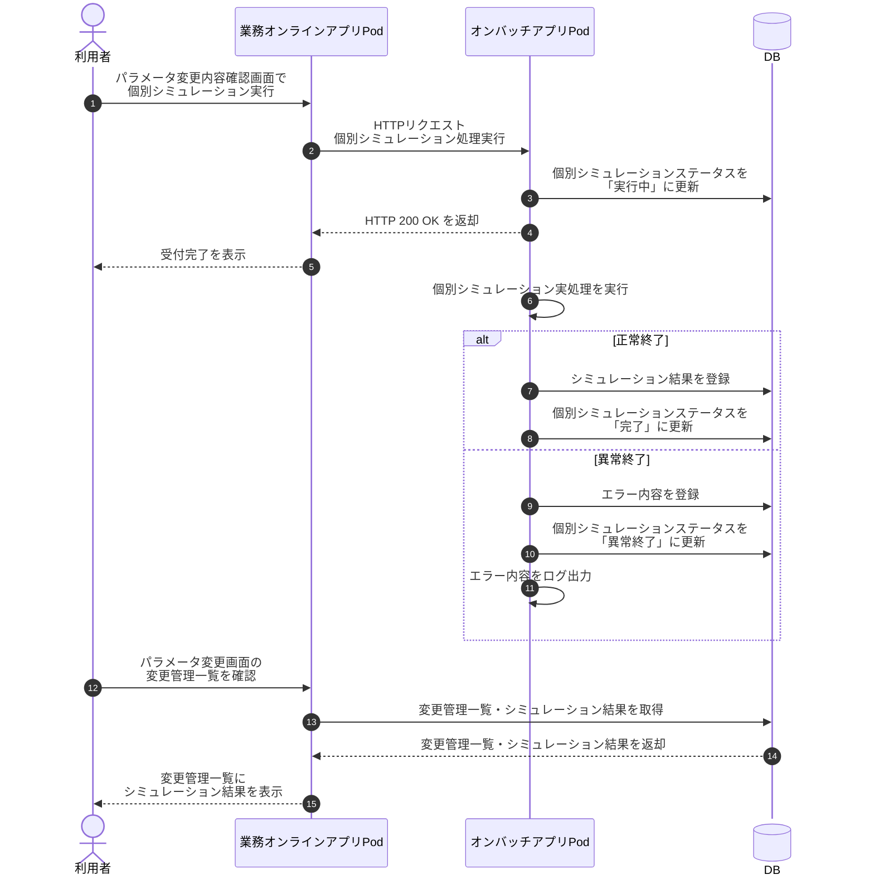
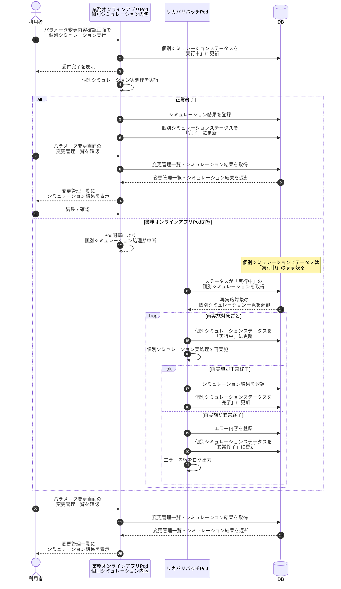

# 個別シミュレーションの実装方式によるシーケンスの違い

## 個別シミュレーション(オンバッチアプリ)を別Podとする

```mermaid
sequenceDiagram
    autonumber

    actor U as 利用者
    participant O as 業務オンラインアプリPod
    participant B as オンバッチアプリPod
    participant DB@{ "type" : "database" }

    U->>O: パラメータ変更内容確認画面で<br/>個別シミュレーション実行
    O->>B: HTTPリクエスト<br/>個別シミュレーション処理実行

    B->>DB: 個別シミュレーションステータスを<br/>「実行中」に更新
    B-->>O: HTTP 200 OK を返却
    O-->>U: 受付完了を表示

    B->>B: 個別シミュレーション実処理を実行

    alt 正常終了
        B->>DB: シミュレーション結果を登録
        B->>DB: 個別シミュレーションステータスを<br/>「完了」に更新

    else 異常終了
        B->>DB: エラー内容を登録
        B->>DB: 個別シミュレーションステータスを<br/>「異常終了」に更新
        B->>B: エラー内容をログ出力
    end

    U->>O: パラメータ変更画面の<br/>変更管理一覧を確認
    O->>DB: 変更管理一覧・シミュレーション結果を取得
    DB-->>O: 変更管理一覧・シミュレーション結果を返却
    O-->>U: 変更管理一覧に<br/>シミュレーション結果を表示

```

## 閉塞後バッチにて対応

```mermaid
sequenceDiagram
    autonumber

    actor U as 利用者
    participant O as 業務オンラインアプリPod<br/>個別シミュレーション内包
    participant R as リカバリバッチPod
    participant DB@{ "type" : "database" }


    U->>O: パラメータ変更内容確認画面で<br/>個別シミュレーション実行
    O->>DB: 個別シミュレーションステータスを<br/>「実行中」に更新
    O-->>U: 受付完了を表示

    O->>O: 個別シミュレーション実処理を実行

    alt 正常終了
        O->>DB: シミュレーション結果を登録
        O->>DB: 個別シミュレーションステータスを<br/>「完了」に更新

        U->>O: パラメータ変更画面の<br/>変更管理一覧を確認
        O->>DB: 変更管理一覧・シミュレーション結果を取得
        DB-->>O: 変更管理一覧・シミュレーション結果を返却
        O-->>U: 変更管理一覧に<br/>シミュレーション結果を表示
        U->>O: 結果を確認

    else 業務オンラインアプリPod閉塞
        O--xO: Pod閉塞により<br/>個別シミュレーション処理が中断

        Note over DB: 個別シミュレーションステータスは<br/>「実行中」のまま残る

        R->>DB: ステータスが「実行中」の<br/>個別シミュレーションを取得
        DB-->>R: 再実施対象の<br/>個別シミュレーション一覧を返却

        loop 再実施対象ごと
            R->>DB: 個別シミュレーションステータスを<br/>「実行中」に更新
            R->>R: 個別シミュレーション実処理を再実施

            alt 再実施が正常終了
                R->>DB: シミュレーション結果を登録
                R->>DB: 個別シミュレーションステータスを<br/>「完了」に更新
            else 再実施が異常終了
                R->>DB: エラー内容を登録
                R->>DB: 個別シミュレーションステータスを<br/>「異常終了」に更新
                R->>R: エラー内容をログ出力
            end
        end
    end

    U->>O: パラメータ変更画面の<br/>変更管理一覧を確認
    O->>DB: 変更管理一覧・シミュレーション結果を取得
    DB-->>O: 変更管理一覧・シミュレーション結果を返却
    O-->>U: 変更管理一覧に<br/>シミュレーション結果を表示
```
