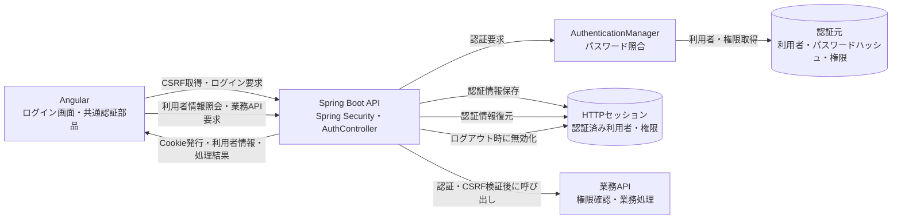
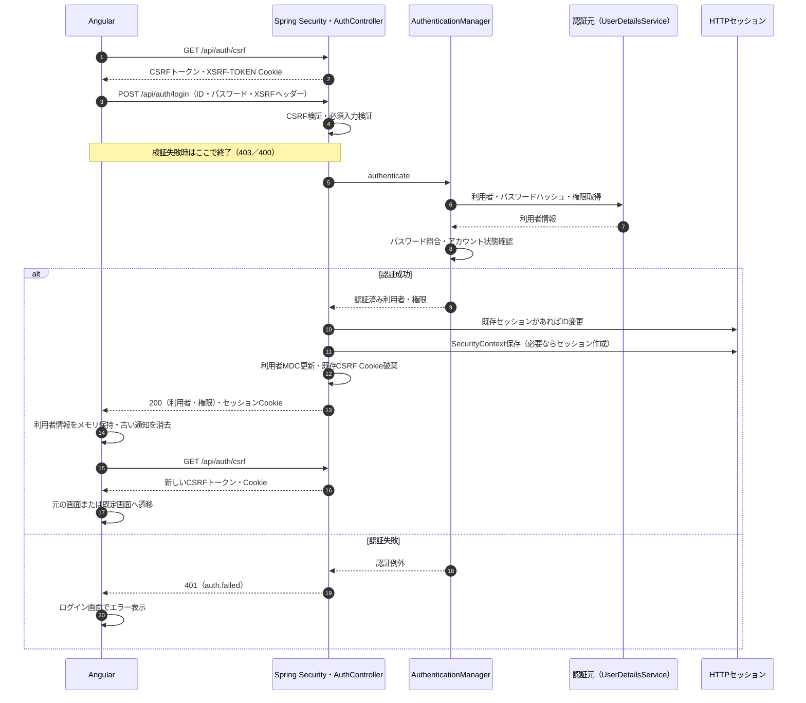
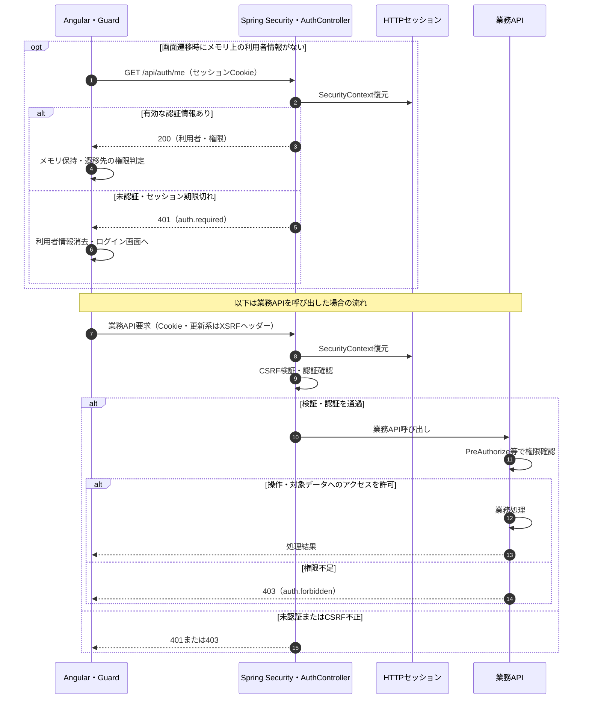
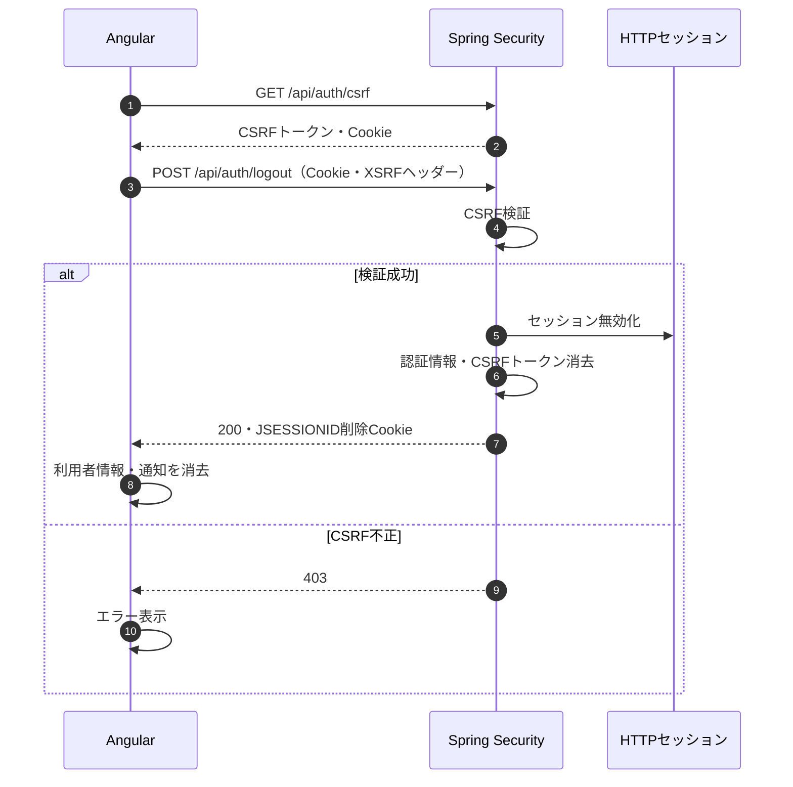

# 認証処理方式

## 1. 目的・適用範囲

AngularからSpring Boot APIを利用する利用者を認証し、利用者に付与された権限に応じて画面・APIへのアクセスを制御する。
基本方式は、ユーザーID・パスワードによるログインと、HTTPセッション・Cookieによる認証状態の継続とする。
画面とAPIは同一オリジンで公開し、Angularは相対URLの`/api`経由で通信する。
更新系APIにはCSRFトークンを付与し、API側で検証する。

本書は現在のサンプル実装を基準に、運用時の設計方針を整理する。実装済みの範囲と追加対応が必要な範囲は7章に示す。
現状の認証元は開発用のインメモリ利用者情報であり、本番用ユーザーDB、SSO、MFA、分散セッションは未実装である。
システム間API・バッチの認証は対象外とし、ブラウザーのセッションを流用せず別途設計する。
非同期処理の依頼者情報の引き継ぎは[大規模処理方式](大規模処理方式.md)を参照する。

## 2. 構成と責務

| 構成要素 | 責務 |
| -------- | ---- |
| Angularのログイン画面 | ID・パスワード入力、必須チェック、送信中の二重操作防止、ログイン後の画面遷移 |
| LoginService／SessionService | CSRF取得、ログイン・ログアウト、利用者情報のメモリ保持、セッション復元 |
| Guard／権限制御部品 | 認証状態に応じた画面遷移、権限に応じた画面・ボタン制御 |
| HttpClient／apiInterceptor | Cookie付きAPI通信、XSRFヘッダー付与、401・403等の共通エラー処理 |
| Spring Security | セッションからの認証復元、CSRF検証、API認証・認可、ログアウト |
| AuthController | CSRF取得、JSONログイン、認証結果のセッション保存、現在の利用者情報取得 |
| AuthenticationManager／認証元 | 利用者検索、パスワード照合、権限の取得 |
| HTTPセッション | サーバー側の認証情報・権限の保持。現状はアプリケーションインスタンス内で管理 |
| 業務API／UserContext | 業務権限の検証、認証済み利用者の取得、監査情報への反映 |

認証は「誰であるか」、認可は「どの操作・データを扱えるか」の判定とする。
画面側の権限制御は操作案内であり、API側の認可を必須とする。

### 2.1 フローチャート（構成・データの流れ）

構成要素を横方向に並べ、認証経路と認証情報の流れを示す。詳細な順序は後述のシーケンス図で示す。

認証元は論理的な名称であり、現状は`UserDetailsService`が開発用利用者をメモリから取得する。
HTTPセッションと認証元は別の役割を持ち、ログイン後の各API要求で毎回パスワードを照合する構成にはしない。

## 3. シーケンス図

### 3.1 CSRF取得・ログイン

`/api/auth/login`は未認証で呼び出せるが、CSRF検証の対象である。
認証失敗時の文言はユーザーIDとパスワードのどちらが誤っているかを区別しない。
ログイン後の戻り先はアプリ内のURLに制限する。
ログイン成功後のCSRF再取得が失敗した場合、サーバー側では認証済みの場合があるため、認証失敗と同一視しない。再取得・画面復帰の扱いは追加設計事項とする。

### 3.2 セッション復元・業務APIの認証と認可

現状の業務APIは`project:read`・`project:write`を`@PreAuthorize`で検証する。
利用者ごと・組織ごとにデータ参照範囲が異なる場合は、対象データの所有者・所属等もサーバー側で検証する設計を追加する。
セッション期限切れの更新要求でも、CSRF検証の成否によっては認証確認より先に403が返るため、常に401になるとは限らない。

### 3.3 ログアウト

ログアウトはSecurityフィルターで処理し、AuthControllerには実装しない。
通信失敗時はサーバー側の無効化結果が不明なため、画面側だけでログアウト完了と判定しない。
現状のLoginServiceは成功応答を受けた場合にだけ利用者情報・通知を消去する。

## 4. 管理データ・状態

### 4.1 管理情報の分担

| 管理先 | 保存内容 | 目的・扱い |
| ------ | -------- | ---------- |
| 認証元 | ユーザーID、パスワードハッシュ、権限、アカウント状態 | ログイン時の照合。現状は開発用メモリ情報 |
| HTTPセッション | SecurityContext内の認証済み利用者・権限 | リクエストごとの認証復元 |
| JSESSIONID Cookie | セッション識別子 | ブラウザーが送信。JavaScriptから読み取らない |
| XSRF-TOKEN Cookie | CSRFトークン | Angularが読み、更新系要求のヘッダーに設定 |
| AngularのSessionService | username・authorities | メモリ上での表示・画面制御。再読み込み時は消失 |
| ログ・監査情報 | 利用者ID、トレースID、日時、操作・結果 | 操作追跡。認証情報そのものは記録しない |

認証情報・セッション識別子をlocalStorageやsessionStorageへ保存しない。
権限の正当性はサーバー側で判定し、画面から送信されたユーザーID・権限一覧を信用しない。

### 4.2 状態・応答と画面側の扱い

| 状態・応答 | 意味 | 画面側の扱い |
| ---------- | ---- | ------------ |
| 未確認 | メモリに利用者がなく、セッションの有効性が不明 | Guardが`/auth/me`で復元を試みる |
| 認証済み | 有効なセッションあり | 利用者・権限を保持し、画面の権限を確認 |
| 400 | ログイン必須項目等の入力不備 | 入力内容を修正 |
| 401／auth.failed | ID・パスワード等の認証失敗 | ログイン画面に留まりエラー表示 |
| 401／auth.required | 未認証・期限切れ等 | 通常のAPI通信では利用者情報を消去しログインへ誘導 |
| 403／auth.forbidden | 権限不足またはCSRF検証失敗 | エラー表示。更新要求を自動再送しない |
| 通信失敗・5xx | ネットワーク・サーバー障害 | 処理結果を確認し、必要に応じて再操作 |

現在のCSRFエラーと権限不足は同じ403・エラーコードになる。復旧操作を分ける場合はコード・表示の分離が必要である。
`restore()`は401以外の障害も含めて利用者情報を消去し`null`を返すため、Guard経由では通信障害でもログインへ誘導される。この区別の改善は追加対応とする。

## 5. セッション・Cookie・CSRFの処理

### 5.1 セッション管理

- ログイン成功時、既存セッションがあればIDを変更し、認証結果を`HttpSessionSecurityContextRepository`で明示的に保存する。
- 現在の設定ではセッションの非活動タイムアウトは30分とする。ログインからの絶対有効期限とは区別する。
- JSESSIONIDには`HttpOnly=true`・`Secure=true`・`SameSite=Lax`を設定し、本番はHTTPSで公開する。
- ログアウト時はサーバーのセッションを無効化し、ブラウザーのJSESSIONIDを削除する。
- 権限変更・アカウント停止を既存セッションへ即時反映する仕組みは未実装である。強制失効、再認証、有効期限による反映のいずれを採るかを決める。
- セッションをインスタンス内に保持する現状では、再起動・別インスタンスへの振り分けにより認証を継続できない場合がある。複数台構成では共有セッション等を設計する。

### 5.2 CSRF対策

AngularのHttpClientが`XSRF-TOKEN` Cookieを読み、対象となる更新系要求に`X-XSRF-TOKEN`ヘッダーを付与する。サーバーは両者を検証する。本構成では相対URLでAPIを呼び出す。[Angular公式：セキュリティ](https://angular.dev/best-practices/security)

- CSRF CookieはAngularから読むためHttpOnlyを付けない。認証Cookieとは目的・設定を分ける。
- ログイン前に`GET /api/auth/csrf`を呼び、ログイン要求自体もCSRF検証する。
- ログイン成功時に古いトークンを破棄し、直後に再取得する。ログアウト前にも取得する。
- ログイン後・ログアウト後のトークン更新を考慮してSPAの通信順序を設計する。[Spring Security公式：CSRF](https://docs.spring.io/spring-security/reference/servlet/exploits/csrf.html)
- GET等の参照APIに業務データの更新を実装しない。CSRFエラーを回避するために保護を無効化しない。
- 画面再読み込み後のトークン欠落や複数タブでの更新に備え、再取得導線を設計する。現状の`restore()`はCSRF再取得を行わない。

## 6. 認可・エラー・再操作

- 公開APIはCSRF取得・ログインとし、業務APIは認証を必須とする。ログアウトは専用フィルターで処理する。
- APIの操作権限は`@PreAuthorize`等で判定し、データ単位のアクセス制御が必要な業務では追加検証する。
- Guardは認証復元後に権限を確認する。現状は認証確認も含む`permissionGuard`を利用する。
- 認証切れを検知しても更新要求を自動再送しない。再ログイン後に保存済みデータを確認して再操作する。
- 403だけを根拠にログアウトさせない。権限不足とCSRF不正を切り分け、必要な復旧方法を案内する。
- 複数タブは同じCookieを共有するが、画面のメモリ状態は別である。他タブのログアウト後は次回API要求で失効を検知する。即時の画面同期は追加設計とする。
- 非同期処理には受付時の認証済み利用者IDを保存する。ブラウザーのセッションCookieやパスワードをワーカーへ渡さない。

## 7. 準備と実装範囲

| 対象 | 現在の実装 | 本番に向けた準備・追加対応 |
| ---- | ---------- | ------------------------ |
| 認証元 | devプロファイルのインメモリ利用者 | 本番用UserDetailsService、利用者・権限・アカウント状態管理 |
| パスワード | BCryptで照合 | 登録・変更・リセット、ポリシー、ハッシュ更新方針 |
| ログイン防御 | 必須チェック・画面の二重送信防止 | 試行回数制限、ロックと解除、不正ログイン検知 |
| セッション | インスタンス内のHTTPセッション、30分の非活動期限 | 複数台での共有方式、絶対期限、同時ログイン、強制失効 |
| Cookie・公開経路 | 認証Cookie属性設定、同一オリジン前提 | HTTPS終端、プロキシ設定、Cookie属性・削除の実環境確認 |
| 認可 | 画面Guard・ボタン制御・API操作権限 | 業務に応じた所有者・組織単位のデータ認可 |
| エラー復旧 | 401誘導、403通知、更新系の自動再送なし | 通信障害と未認証の区別、CSRF復旧、複数タブ対応 |
| SSO・MFA | 未実装 | 採用要否、認証基盤、ログアウト・権限連携方式 |
| 認証監査 | 利用者MDC・共通ログ基盤 | 成功・失敗・ロック・失効等のイベント、監視・保存方針 |

SSOを採用する場合はログイン処理・コールバック・セッション作成・ログアウトを含めて方式を見直す。UserDetailsServiceの差し替えだけでSSOが完成するものではない。

主な実装参照先は次のとおり。

| 範囲 | 参照先 |
| ---- | ------ |
| API認証・CSRF・ログアウト | [SecurityConfig.java](../platform-springboot/src/main/java/jp/example/common/security/SecurityConfig.java) |
| ログイン・CSRF取得・利用者照会 | [AuthController.java](../platform-springboot/src/main/java/jp/example/common/security/AuthController.java) |
| 開発用認証元 | [DemoSecurityConfig.java](../business-springboot/src/main/java/jp/example/business/DemoSecurityConfig.java) |
| セッション期限・Cookie | [application.yml](../business-springboot/src/main/resources/application.yml) |
| Angularの認証通信 | [login.service.ts](../platform-angular/src/lib/core/login.service.ts) |
| 画面認証・権限確認 | [guards.ts](../platform-angular/src/lib/core/guards.ts) |
| API共通エラー処理 | [api.interceptor.ts](../platform-angular/src/lib/core/api.interceptor.ts) |

## 8. ログ・監査・運用

- 認証済みユーザーIDとトレースIDを使い、画面の問い合わせ情報とAPIログを対応付ける。
- パスワード、Cookie、CSRFトークン、認証要求本文をログへ出力しない。アクセスログ・プロキシ・監視基盤も対象にする。
- ログイン成功・失敗、ログアウト、アカウントロック、強制失効、権限変更の監査イベントと保持期間を定義する。
- 認証失敗の急増、特定利用者への集中、セッション保存先の障害、403の増加を監視する。
- 本番では開発用利用者・パスワード案内を使用せず、認証元・設定を切り替える。
- 再起動・ローリング更新・セッション保存先障害時の利用者への影響と復旧手順を定める。

## 9. 実装・運用前に確定する項目

| 項目 | 確定する内容 |
| ---- | ------------ |
| 認証方式・認証元 | ID／パスワード継続かSSOか、MFA、ユーザー情報の管理責任 |
| アカウント運用 | 発行・停止・削除、パスワード変更・再設定、ロック条件・解除手順 |
| 権限 | ロールと操作権限、データ範囲、変更時の既存セッションへの反映 |
| セッション | 非活動期限・絶対期限、同時ログイン、強制失効、複数台構成 |
| 公開経路 | 同一オリジンの構成、HTTPS、Cookie属性、プロキシとの連携 |
| エラー復旧 | 401・403・通信障害の表示、CSRF再取得、複数タブ、再ログイン後の扱い |
| 監査・監視 | 記録イベント、保持期間、検知条件、問い合わせ・復旧手順 |

受入確認では、正常ログイン・誤入力・期限切れ・権限不足・CSRF欠落／不一致・ログアウト後の再アクセスを確認する。
あわせて画面再読み込み、複数タブ、ログイン直後の通信失敗、再起動・複数台振り分け時の認証継続を確認する。
