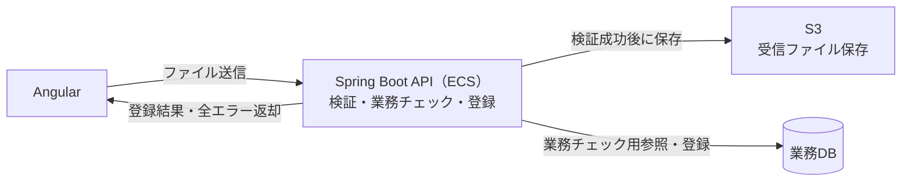
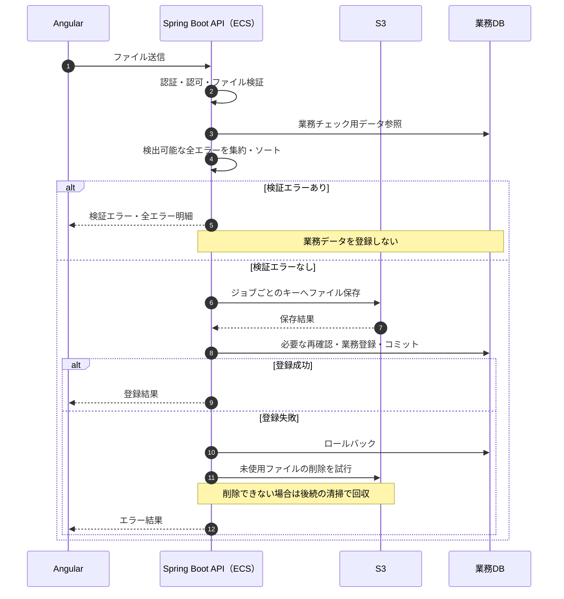
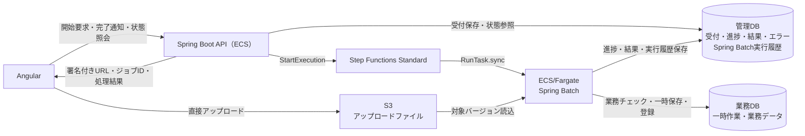
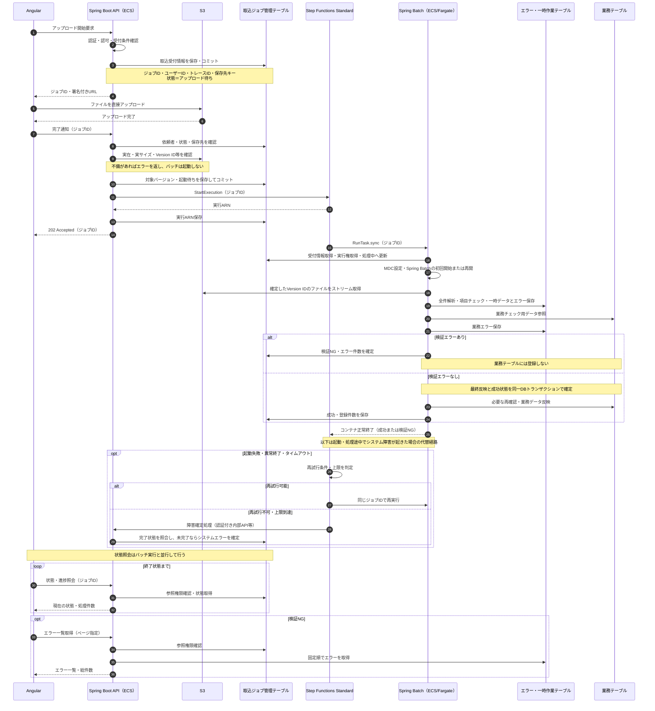

# ファイルアップロード処理方式

## 1. 目的・前提

AngularからアップロードしたファイルをS3に保存し、Spring側で検証・業務チェック・登録を行う方式を定義する。
APIはECSで稼働し、大規模処理はStep Functions StandardからECS/Fargate上のSpring Batchを起動する。

- ファイルの正式なバリデーション・業務チェック・登録判断はSpring側で行う。Angularの選択時チェックは操作支援にとどめる。
- 検証エラーがある場合、業務テーブルへの登録は行わない。S3への一時保存や管理テーブルへの保存は業務登録と区別する。
- 検出可能なエラーをすべて返却または保存し、固定順でAngularに表示する。
- 本書はAWS向けの設計方針である。現在のローカルサンプルにS3・Step Functions・Spring Batchが実装済みであることを意味しない。

## 2. 処理方式と選定基準

| 方式                   | アップロード経路               | 検証・登録                                                        | 主な用途                           |
| ---------------------- | ------------------------------ | ----------------------------------------------------------------- | ---------------------------------- |
| 方式1：Spring Boot経由 | Angular → Spring Boot API → S3 | 原則としてAPI内で同期処理                                         | 小容量・短時間・低頻度             |
| 方式2：S3直接          | Angular → S3（署名付きURL）    | 本書ではStep Functions＋ECS/Fargate＋Spring Batchによる非同期処理 | 大容量・長時間・同時実行の多い処理 |

原則として方式1を採用し、次のいずれかに該当する場合は方式2を採用する。

1. 1ファイルが1MBを超える。
2. 方式1で送る場合の1リクエスト全体が10MBを超える。
3. 容量にかかわらず、業務チェックや登録が長時間に及び、同期APIの応答時間目標を満たせない。
4. 同時アップロードによるAPIのメモリ・通信・処理負荷が許容範囲を超える。

上記の1MB／10MBは本プロジェクトの選定基準であり、AWSサービスの上限ではない。
容量の比較はバイト単位で行い、本書では既存Spring設定に合わせて1MB＝1,048,576バイト（1MiB）、10MB＝10,485,760バイト（10MiB）とする。
リクエスト全体にはファイル以外のフォーム項目・multipartの付加情報も含める。
APIの許容時間・同時実行数・方式2の最大容量／件数は、負荷試験と業務要件で別途確定する。

アップロード経路と同期／非同期は独立した設計要素である。例えば小容量でも重い集計なら非同期処理とし、S3直接でも短時間なら同期検証という組合せは可能。

## 3. 方式1：Spring Boot経由の同期処理

既存APIでファイルを受信し、全件検証が成功してからS3保存と業務登録へ進む。
全エラーをそのリクエストのレスポンスで返せるため、小容量では構成と画面制御が簡単になる。

### 3.1 フローチャート（構成・データの流れ）

条件分岐の詳細ではなく、構成要素を横方向に並べ、通信・データの流れを示す。

### 3.2 シーケンス図

S3保存に失敗した場合は業務登録へ進まない。S3とDBは同一トランザクションではないため、DB登録失敗後に残ったファイルを清掃する。
登録結果が不明な場合はDBを照合してから削除し、登録済みのファイルを誤って消さない。

## 4. 方式2：S3直接アップロード＋非同期処理

Spring Boot APIは認証・認可後に署名付きURLを発行する。AngularがS3へアップロードした後、APIが対象ファイルを確認して処理を受け付ける。
APIから`StartExecution`を呼び、Step Functions Standardの`ecs:runTask.sync`でバッチ用コンテナを起動して終了まで待機する。
APIはバッチ完了まで待たず、受付結果とジョブIDを返す。[AWS公式：ECS連携](https://docs.aws.amazon.com/step-functions/latest/dg/connect-ecs.html)

### 4.1 フローチャート（構成・データの流れ）

### 4.2 シーケンス図

管理DB・業務DBは論理的な役割の表記であり、同一DB内の別テーブルを想定する。別DBへ分離する場合は、業務反映と状態更新の整合性を別途設計する。
Spring Batch自身の管理テーブルへのアクセスは、シーケンス図を読みやすくするため省略している。
障害確定用の内部APIは認証・通信経路を設計する必要があり、既存の非公開APIをStep Functionsから無条件に呼べるという意味ではない。

### 4.3 管理情報の役割

| 保存先                   | 主な内容                                                                    | 用途                                           |
| ------------------------ | --------------------------------------------------------------------------- | ---------------------------------------------- |
| 取込ジョブ管理テーブル   | ジョブID・依頼者・トレースID・S3キー／Version ID・実行ARN・状態・件数・日時 | 利用者向けの受付・進捗・結果照会、二重実行防止 |
| 取込エラーテーブル       | ジョブID・行番号・項目ID／順序・ルール順・コード・メッセージ                | 全エラーの固定順表示・ダウンロード             |
| 一時作業テーブル         | ジョブごとの解析済みデータ                                                  | 全件チェック・最終反映前の一時保存             |
| Spring Batch管理テーブル | Job／Step実行履歴・ExecutionContext等                                       | 障害後の再開・実行管理                         |
| 業務テーブル             | 確定した業務データ                                                          | 通常業務で利用する登録結果                     |

状態の基本遷移は「アップロード待ち → 起動待ち → 処理中 → 成功／検証NG／システムエラー」とする。
放置されたアップロード待ちは期限切れとして清掃する。検証NGは業務結果として確定し、自動再試行しない。

## 5. 全件検証・大容量処理・再実行

### 5.1 Spring Batchの処理分割

1. ファイルを順次読み、項目チェック結果と解析データを一時保存する。
2. ファイル内重複やDBとの整合性など、全件の業務チェックを行う。
3. エラーがあれば検証NGを確定し、登録Stepには進まない。
4. エラーがなければ業務データへ反映し、成功状態を確定する。

ファイル全体・全行・全エラーをメモリ上のリストに保持しない。
一時データはチャンク単位で保存できるが、業務テーブルへ順次コミットすると後半のエラーで前半を戻せない。
全件一括反映が重い場合は、完了した登録バッチだけを業務から参照できるようにする方式を別途検討する。
検証と反映の間に他処理がデータを変更し得るため、最終反映時の再確認・DB制約・競合制御を組み合わせる。

### 5.2 エラーの固定順表示

エラーは「行番号 → 項目順 → ルール順 → 項目ID → エラーコード」の順で並べる。
同じキーのエラーが複数ある設計では、決定的な詳細番号を追加する。登録順や並列処理の完了順には依存しない。
AngularはAPIの順序を維持し、件数が多い場合は全件保存のうえページ分割表示・全エラーダウンロードを提供する。
処理完了後にエラー集合を確定してからページ取得し、ページ間で結果が入れ替わらないようにする。
文字コード不正などで読み取り不能な場合は、推測で続行せず、判定できた範囲と継続不能理由を返す。

### 5.3 起動・再試行・障害時の整合性

- 受付情報をDBにコミットしてから起動する。起動待ちのまま残ったジョブを再送・照合する仕組みを設ける。
- DB保存と`StartExecution`は分散トランザクションにならない。実行名と入力を固定し、通信失敗時に既存実行を照合する。
- Standardの`StartExecution`は、実行中の同じ実行名・同じ入力なら同じ実行を返す。終了済みや入力違いでは`ExecutionAlreadyExists`になるため、無条件に新規起動しない。[StartExecution仕様](https://docs.aws.amazon.com/step-functions/latest/apireference/API_StartExecution.html)
- ジョブIDによる排他と業務登録の重複防止を設ける。Step Functionsの再試行だけで一度だけの業務登録は保証されない。
- Spring Batchの識別パラメータ・チェックポイント・Reader／Writerを再開可能に設計する。異常終了で実行中のまま残った履歴は、元タスクの停止を確認してから復旧する。
- 通信障害などの一時障害だけを、回数・間隔・タイムアウトを制限して再試行する。業務NGと恒久的な設定不備は自動再試行しない。
- Batch失敗を非ゼロ終了コードへ対応させる。コンテナ正常終了は成功と検証NGの両方を含むため、成功時限定の後続処理はDBの業務結果を確認する。
- ワーカーが起動しない／強制終了する場合もあるため、障害確定はワーカー外から行えるようにする。ワークフロー全体の中断・タイムアウトも定期照合等で回収する。
- 同時実行数はDB接続・CPU・処理量に合わせて制御する。Step Functionsを増やすだけでは複数実行全体の流量制御にはならない。

## 6. S3・認証・ログ・運用

- バケットは非公開とし、署名付きURLは認証・認可後に短い有効期間で発行する。保存先キーはAPIが生成し、他利用者のファイルを指定できないようにする。
- AngularにはAWSの固定アクセスキーを配布しない。ブラウザーからの直接転送に必要なS3 CORSを設定する。
- 完了通知の申告値だけを信用せず、実在・実サイズ・所有関係等をサーバーで確認する。署名付きURLは容量制限の代替にならず、選択したアップロード方式に応じた制限も設ける。
- 署名付きURLは有効期間内に再利用され、同じキーへ上書きされ得る。S3バージョニングを有効にして処理対象Version IDを固定し、検証中の差し替えを防止する。[署名付きURLの仕様](https://docs.aws.amazon.com/AmazonS3/latest/userguide/using-presigned-url.html)
- ジョブ受付時に認証済みユーザーIDとトレースIDを保存する。バッチ開始時にこれらとジョブIDをMDCへ設定し、終了時に復元する。スレッド並列化時も明示的な引き継ぎを行う。
- 署名付きURL・認証情報・ファイル本文をログへ出力しない。S3一時ファイル・旧バージョン・一時作業データ・エラー履歴には保持期限を設定する。
- 大容量の転送には必要に応じてマルチパートアップロードを用い、未完了アップロードも清掃対象とする。
