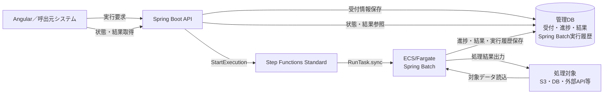
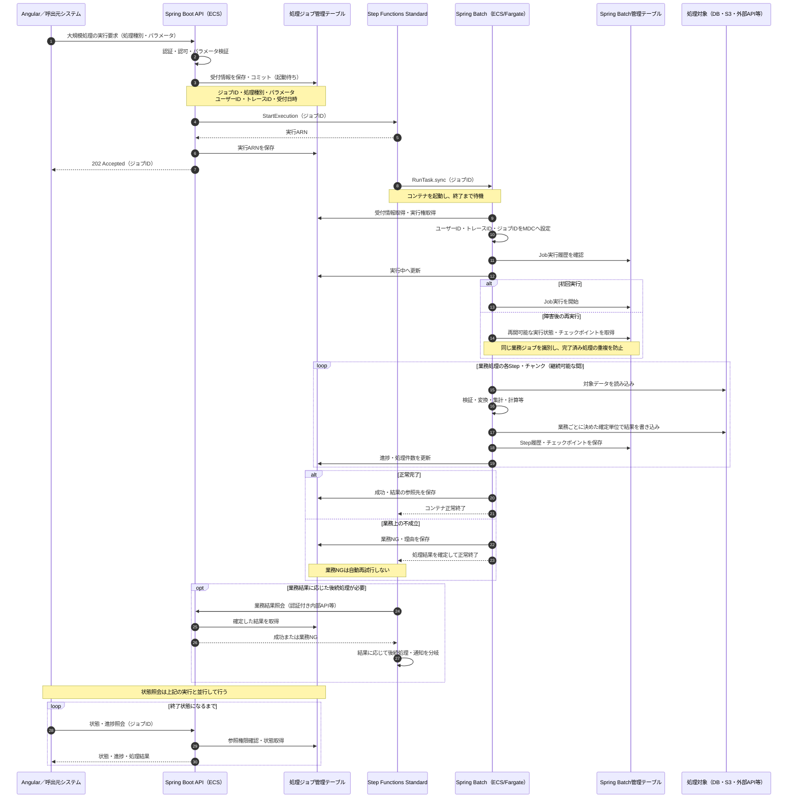
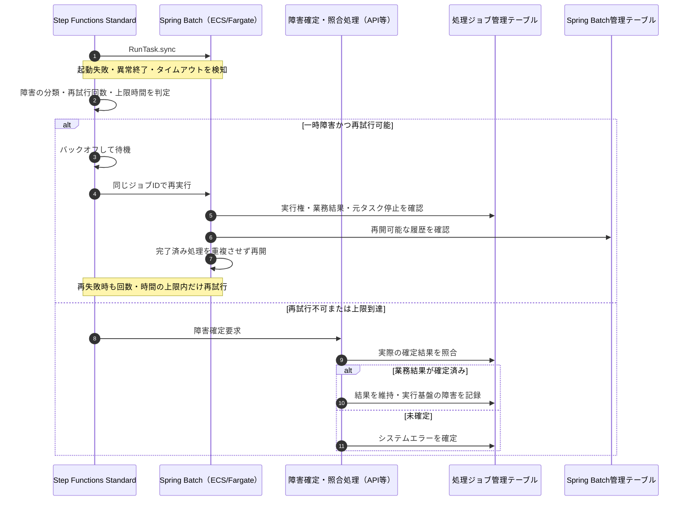

# 大規模処理方式

## 1. 目的・適用範囲

集計・一括更新・データ連携・帳票生成など、同期API内では応答時間や負荷の要件を満たせない処理を非同期で実行する。
Angular／呼出元システムがSpring Boot APIへ実行要求を送り、APIがAWS SDK for Java v2の`StartExecution`でStep Functions Standardを開始する。
Step Functionsは`ecs:runTask.sync`でECS/Fargate上のSpring Batchを起動し、終了まで待機する。
APIは処理完了を待たずにジョブIDを返し、呼出元は別APIで進捗・結果を取得する。

本書は実装に向けた設計方針であり、現在のサンプルにAWS連携・Spring Batchが実装済みであることを意味しない。
ファイルの転送方式・署名付きURL・全件検証は[ファイルアップロード処理方式](ファイルアップロード処理方式.md)を参照する。

## 2. 構成と責務

| 構成要素                | 責務                                                                        |
| ----------------------- | --------------------------------------------------------------------------- |
| Angular／呼出元システム | 実行要求、受付結果の保持、進捗・結果の表示                                  |
| Spring Boot API         | 認証・認可、受付条件の検証、ジョブ管理、ワークフロー開始、結果照会          |
| Step Functions Standard | ECSタスクの起動・完了待ち、障害時の分岐・再試行、必要な後続処理             |
| ECS/Fargate             | バッチ用コンテナの実行環境。処理完了後にタスクを終了                        |
| Spring Batch            | Job／Stepによる業務処理、チャンク処理、実行履歴・チェックポイントによる再開 |
| 管理DB                  | 受付・進捗・業務結果と、Spring Batchの実行メタデータを永続化                |
| 処理対象                | DB・S3・外部APIなどの入力元・出力先                                         |

基本単位は「1つの処理ジョブID＝1つの業務処理依頼」とする。
初期構成では1回のタスク起動で1つのSpring Batch Jobを実行し、業務処理の各段階はSpring BatchのStepで分ける。
再試行により、同じ処理ジョブIDに複数のECSタスク起動やBatch実行履歴が対応する場合がある。
業務Stepの区切りごとにコンテナを起動し直す構成にはしない。

### 2.1 フローチャート（構成・データの流れ）

構成要素を横方向に並べ、起動経路とデータの流れを示す。詳細な順序は後述のシーケンス図で示す。

管理DBは論理的な名称であり、処理ジョブ管理テーブルとSpring Batch管理テーブルは別の役割を持つ。
業務DBと同じDBに置いてもよい。S3・外部APIは管理DBと同じトランザクションでは更新できない。

## 3. シーケンス図

### 3.1 受付・実行・結果照会

以下は開始要求が受け付けられた場合の流れである。起動失敗・処理途中の障害は3.2に示す。

受付条件を満たさない場合は4xxエラーを返し、処理は起動しない。
`202 Accepted`は処理の受付を示し、業務処理の成功を保証しない。
実行ARN保存時には状態を起動待ちに戻さない。タスクが先に進んでいる可能性があるため、状態更新には条件付き更新や楽観ロックを使う。

### 3.2 システム障害・再試行

障害確定処理はワーカー外から実行できるようにする。タスクが起動しない、または強制終了される場合、ワーカー自身は状態を更新できない。
内部APIを利用する場合は認証・接続経路を設計する。Step Functionsから既存の非公開APIを無条件に呼べるわけではない。
ワークフロー全体の中断・タイムアウト・障害確定処理自体の失敗は、この分岐だけに依存せず定期照合などで回収する。

## 4. 管理データ・状態

### 4.1 管理情報の分担

| 管理先                   | 保存内容                                                                                 | 目的                                         |
| ------------------------ | ---------------------------------------------------------------------------------------- | -------------------------------------------- |
| 処理ジョブ管理テーブル   | ジョブID、処理種別、確定したパラメータ、依頼者、トレースID、状態、件数、日時、結果参照先 | 利用者向けの受付・進捗・業務結果             |
| 実行関連情報             | ジョブIDに対応する実行名・実行ARN、ECSタスクARN、Batch実行ID、試行情報                   | 起動照合・障害調査。必要に応じて別テーブル化 |
| 業務エラー情報           | ジョブID、対象ID／行番号、項目順、ルール順、エラーコード・内容                           | 全エラーの参照・固定順表示                   |
| Spring Batch管理テーブル | JobInstance、JobExecution、StepExecution、ExecutionContext等                             | 技術的な実行履歴・チェックポイント・再開位置 |
| Step Functions実行履歴   | 状態遷移・タスク実行・再試行の履歴                                                       | AWS上の実行制御・調査                        |

Spring Batch管理テーブルを画面向けの業務ジョブ管理の代わりにはしない。
詳細な処理条件や個人情報はDBで管理し、Step Functionsへは原則としてジョブIDだけを渡す。

### 4.2 状態と終了判定

| 状態           | 意味                                           | 呼出元の扱い                           |
| -------------- | ---------------------------------------------- | -------------------------------------- |
| 起動待ち       | 受付済みで実行開始待ち。起動要求の照合中も含む | 状態照会を継続                         |
| 実行中         | バッチ処理中。再試行待ちは試行情報で補足       | 進捗表示・状態照会を継続               |
| 成功           | 業務結果が確定                                 | 結果表示・ダウンロード等               |
| 業務NG         | 入力不備・業務条件不成立等で終了               | 理由・全エラーを表示。自動再試行しない |
| システムエラー | 再試行できない／上限に達した障害               | 問い合わせIDを表示し、復旧手順へ       |

成功と業務NGは処理結果として保存し、コンテナは正常終了させる。システム障害は非ゼロ終了コードへ対応させる。
Step Functionsの成功やコンテナの終了コードだけでは業務成功を判断しない。成功時限定の後続処理は業務結果を照会して分岐する。

## 5. Spring Batchの処理・トランザクション

- 処理種別に応じたJobを起動する。任意のクラス名・コマンドをクライアントから受け取って実行しない。
- ファイル・全件データをメモリへ一括展開せず、ストリーム・ページング・チャンク処理を使う。
- チャンクごとに確定してよい処理と、全件成功が必要な処理を区別する。図の「書き込み」は業務ごとに決めた確定単位を表す。
- 全件検証後に登録する場合は、一時作業テーブルへ保存して全チェックを行い、エラーがなければ最終反映する。途中まで業務テーブルへコミットしてから、後半エラーで全件取り消す設計にはしない。
- 同一DB内で可能な範囲は、業務結果と成功状態を同じトランザクションで確定する。複数DB・S3・外部APIへの書き込みは個別の照合・補償処理が必要。
- 外部APIには必要に応じて冪等キーを渡す。S3出力もジョブごとのキー・公開状態を管理し、再実行で成果物を重複作成・誤公開しない。
- 書き込みとチェックポイントの間で停止しても、データが欠落・重複しないようにトランザクションとReader／Writerを設計する。
- 業務エラーは全件保存し、対象順・項目順・ルール順・コード等の固定順で取得する。大量のエラーはページ分割し、全件ダウンロードも提供する。

## 6. 起動・再実行・二重実行防止

### 6.1 受付から起動まで

1. 認証・認可と入力検証を行い、処理ジョブIDを発行する。
2. 依頼者・トレースID・処理条件・起動待ち状態をDBへ保存してコミットする。
3. ジョブIDから決めた実行名と固定の入力で`StartExecution`を呼ぶ。
4. 返された実行ARNを保存し、受付結果を返す。

DB保存とAWSへの起動要求は一括コミットできない。起動待ち情報を再送可能な記録として扱い、実行有無を照合する仕組みを用意する。
呼出元からの再送も受付要求ID等で同一依頼として識別し、毎回新しいジョブを作らないようにする。
開始要求が不明なまま失敗した場合は、別の実行名で直ちに起動せず既存実行を確認する。

Standardの`StartExecution`は、実行中の同じ実行名・同じ入力なら同じ実行を返す。
終了済みまたは入力が異なる場合は`ExecutionAlreadyExists`になるため、単純な再送だけでは復旧できない。[AWS公式：StartExecution](https://docs.aws.amazon.com/step-functions/latest/apireference/API_StartExecution.html)

### 6.2 再開と排他

- 同じ業務依頼の再試行では、同じ処理ジョブIDと確定済み入力を使う。
- ジョブIDで実行権を排他的に取得する。タスクの停止確認と所有者の管理を行い、古いタスクと再試行タスクが同時に登録しないようにする。
- Spring Batchの識別用JobParametersには安定した値を用いる。再試行のたびに現在時刻を加えて別JobInstanceにすると、元の処理の再開にならない。
- 強制終了によりBatch履歴が実行中のまま残る場合は、元タスクが停止したことを確認して所定の復旧手順を実施する。稼働中の履歴を直接書き換えない。
- 完了済みなら保存済み結果を使用し、業務処理を再実行しない。意図的な新規処理は新しいジョブIDで受け付ける。
- 一時的な障害だけを回数・時間を制限して再試行する。業務NG・権限不足・設定不備などは自動再試行対象から外す。

Step Functionsの再試行、ECSタスクの再起動、Spring Batchの再開は別の仕組みである。
ワークフロー側の再試行を設定するだけで、業務登録が一度だけになるわけではない。

## 7. AWS側の準備と実装範囲

| 準備対象                   | 内容                                                                    |
| -------------------------- | ----------------------------------------------------------------------- |
| バッチ用アプリ・ECR        | Spring Boot＋Spring Batchをコンテナ化。実行終了時にプロセスを終了させる |
| ECSタスク定義              | イメージ・CPU・メモリ・環境変数・タスクロール・ログ出力を設定           |
| ネットワーク               | ECSからDB・S3・外部API、ECR・ログ基盤等への接続を確保                   |
| Step Functions Standard    | `ecs:runTask.sync`、タイムアウト、条件付き再試行、障害確定を定義        |
| APIのタスクロール          | 対象ワークフローの開始、および設計した状態照合に必要な権限              |
| Step Functionsの実行ロール | ECS起動・監視・停止、必要なタスクロールの引き渡し等                     |
| バッチのタスクロール       | 処理に必要なS3等へのアクセス。固定アクセスキーは埋め込まない            |

APIではAWS SDK for Java v2の`SfnClient.startExecution`を利用する。
Step FunctionsはジョブIDをコンテナ環境変数等で渡し、バッチの起動処理がそれをJobParametersへ変換する。
環境変数を渡すだけで自動的にSpring Batchの識別パラメータになるわけではない。
`.sync`はStep Functionsが完了を待つ意味であり、呼出元APIが処理完了まで待つ意味ではない。[AWS公式：ECS/Fargate連携](https://docs.aws.amazon.com/step-functions/latest/dg/connect-ecs.html)

SQSやアプリ用EventBridgeルールは、この基本構成の起動経路には必須ではない。
大量受付の待ち行列制御・他システムへのイベント配信が必要になった場合に追加を検討する。
なお、Step FunctionsのECS完了検知に使われるAWS内部連携用EventBridgeルール・権限は別である。

## 8. ログ・進捗・運用

- 受付時に認証済みユーザーIDとトレースIDを保存し、ワーカーでジョブIDと併せてMDCへ設定する。終了時に復元し、並列処理では各スレッドへ明示的に引き継ぐ。
- Batchの実行ID・Step名・ECSタスクARN等で、再試行ごとのログも区別できるようにする。
- 進捗は処理件数・現在のStepで示す。総件数が不明な処理では、根拠のない進捗率を表示しない。
- 状態照会・結果取得はジョブ所有者または権限のある利用者だけに許可する。ポーリング間隔を制御し、終了状態で停止する。
- DB接続数・CPU・メモリ・外部APIの制限に合わせて同時実行数を制御する。複数のStep Functions実行全体に対する上限も設計する。
- 起動待ちの滞留、処理時間超過、再試行増加、更新の途絶、ワークフロー中断を検知・照合する。
- 管理履歴・エラー・一時データ・成果物・ログには保持期間と清掃手順を設定する。
- Fargateの起動待ち時間も利用者の待ち時間に含める。常駐ワーカーを置かない構成では即時開始を保証しない。

## 9. 実装前に確定する項目

| 項目           | 確定する内容                                           |
| -------------- | ------------------------------------------------------ |
| 対象処理       | 処理種別、入力、成果物、成功・業務NGの定義             |
| データ確定単位 | チャンク確定／全件反映／公開切替、失敗時の補償         |
| 規模・性能     | 最大件数・容量・処理時間、許容同時実行数、起動待ち時間 |
| 再試行・復旧   | 対象障害、回数・間隔、タイムアウト、手動再開の条件     |
| 運用           | 状態照会間隔、監視、通知、履歴・成果物の保存期間       |

費用はFargateの割当資源と実行時間、Step Functionsの状態遷移、DB・S3・通信・ログを合わせて見積もる。
処理の各行をStep Functionsの状態として実行せず、データ単位の繰り返しはSpring Batch内で処理する。
